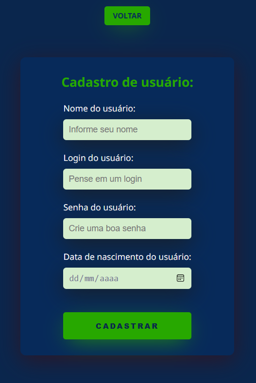
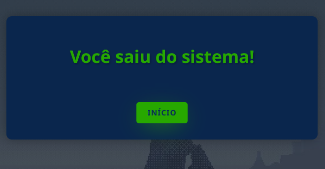
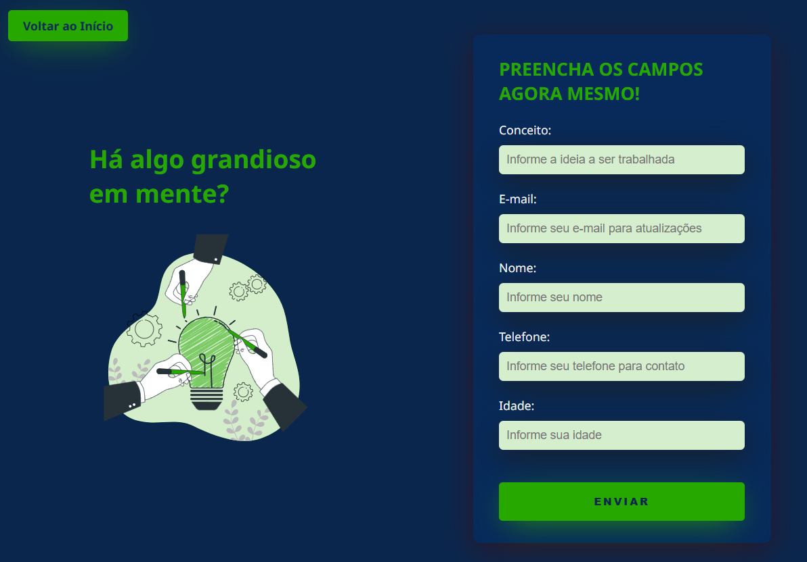
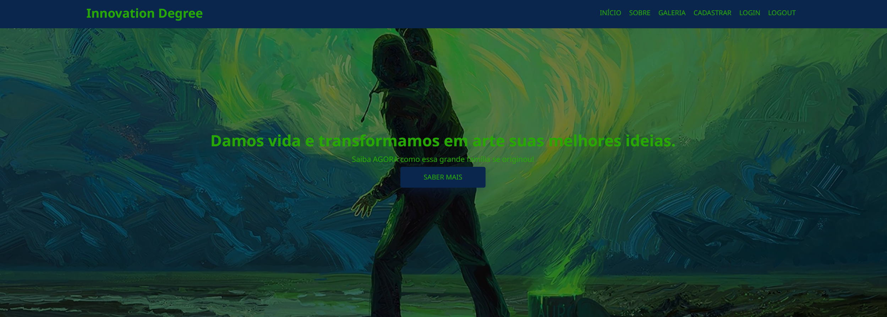
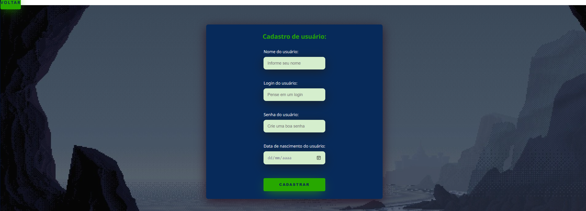

<!-- Projeto em Melhoria -->
# 🧪 Innovation Degree
<p align="center">
  <!-- Contador de linguagens do GitHub -->
  
  <!-- Tamanho do repositório no GitHub -->
  
  <!-- Licença do GitHub -->
  
</p>

<div align="center">
  
</div>

## 💻 Sobre o Projeto
O Innovation Degree foi minha primeira aplicação desenvolvida com a arquitetura MVC (Model-View-Controller), criada durante um curso Técnico em Informática. O projeto passou por atualizações e agora integra funcionalidades de banco de dados com MySQL.

## ⚙️ Funcionalidades
- [x] Design responsivo
- [x] Sistema básico de registro e login
- [x] Submissão de conceitos
- [x] Exibição dinâmica de conteúdo
- [x] Agendamento de entrevistas

## ⚠️ Pré-requisitos
Antes de começar, instale e configure as seguintes ferramentas:
- **[.NET SDK 3.1 ou superior](https://dotnet.microsoft.com/download)**: Necessário para desenvolver e executar a aplicação ASP.NET Core MVC.
- **[MySQL Server 8.0 ou superior](https://dev.mysql.com/downloads/mysql/)**: Para gerenciar o banco de dados utilizado pela aplicação.
- **[MySQL Workbench](https://dev.mysql.com/downloads/workbench/)**: Ferramenta gráfica para administração do MySQL.
- **[Git](https://git-scm.com/downloads)** (opcional): Para clonar o repositório e gerenciar o código-fonte. Verifique a instalação com `git --version`.
- **[Visual Studio Code](https://code.visualstudio.com/)** (opcional): Editor de código recomendado. Instale as extensões [C#](https://marketplace.visualstudio.com/items?itemName=ms-dotnettools.csharp) e [ASP.NET Core](https://marketplace.visualstudio.com/items?itemName=ms-dotnettools.blazorwasm-companion).
- Familiaridade com **C#**, **ASP.NET Core MVC**, e **SQL**: Recomendado para um melhor entendimento do projeto.
- **Conexão com a Internet**: Necessária para restaurar pacotes NuGet e acessar outros recursos online.

## 🧭 Como Executar a Aplicação
```bash
# Clone este repositório
$ git clone https://github.com/devAndreotti/innovation-degree-mvc.git

# Navegue para o diretório do projeto
$ cd innovation-degree-mvc

# Configure o banco de dados
# Abra o MySQL Workbench, crie um novo banco de dados chamado 'destino'
# Importe o script SQL fornecido para configurar as tabelas necessárias

# Atualize a string de conexão
# Modifique os arquivos Models/agendamentoRepository.cs, Models/usuariosRepository.cs e Models/vendaRepository.cs

# Atualize as credenciais do MySQL na string de conexão

# Restaure as dependências
$ dotnet restore

# Inicie a aplicação
$ dotnet run

# Abra um navegador web e acesse
$ https://localhost:5001
```

## 🛠 Tecnologias Utilizadas
- [MySQL (com MySQL Workbench)](https://www.mysql.com/products/workbench/)
- [ASP.NET Core MVC](https://dotnet.microsoft.com/en-us/apps/aspnet/mvc)
- [JavaScript](https://developer.mozilla.org/pt-BR/docs/Web/JavaScript)
- [HTML5](https://developer.mozilla.org/pt-BR/docs/Web/HTML)
- [CSS3](https://developer.mozilla.org/pt-BR/docs/Web/CSS)
- [C#](https://learn.microsoft.com/pt-br/dotnet/csharp/)

## 🔄 Versão 2.0
Responsividade implementada e o CSS foi otimizado e melhorado.
<div align="center">
  
  
  
</div>

## 🔄 Versão 1.0
A aplicação apresentava alguns problemas significativos, como a falta de responsividade e CSS redundante. 
<div align="center">
  
  
</div>

## 💪 Contribuição
1. Faça um fork do projeto.
2. Crie uma nova branch para sua feature: `git checkout -b feature/nome-feature`.
3. Commit suas mudanças: `git commit -m 'Adiciona nova feature'`.
4. Envie para a branch: `git push origin feature/nome-feature`.
5. Abra um Pull Request.

## 📌 Nota do Projeto
Este projeto foi originalmente desenvolvido como parte de uma atividade do **Senac** e está sob a Licença MIT. Sinta-se à vontade para utilizá-lo e modificá-lo conforme os termos da licença.

<br>

---
<p align="center"> Desenvolvido por <a href="https://github.com/devAndreotti">Ricardo Andreotti Gonçalves</a> </p>
